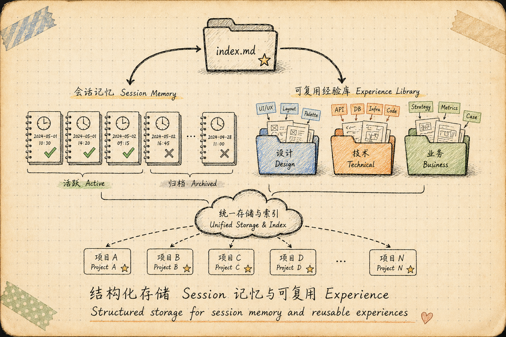
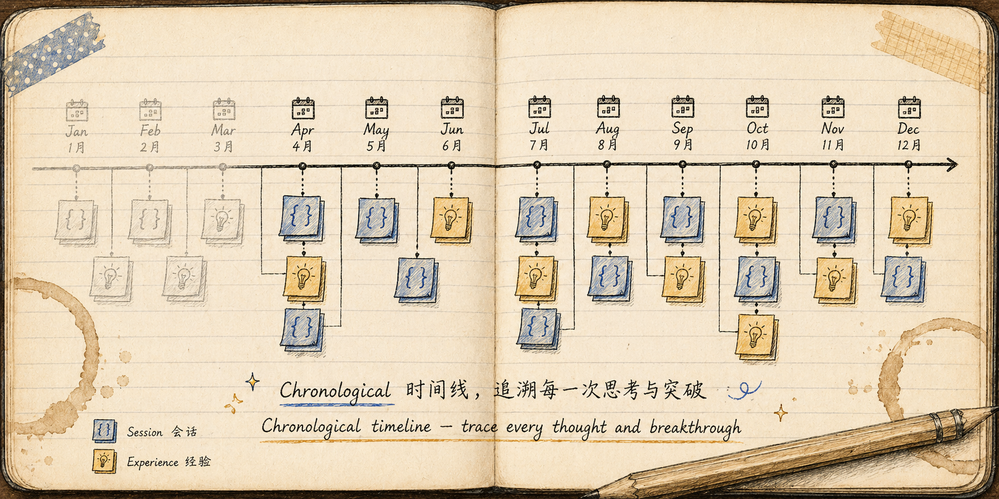

# Session-Engram

[](https://opensource.org/licenses/MIT)
[](https://www.python.org/downloads/)

> **Engram**（记忆痕迹）：记忆在大脑中的物理表示。
>
> 跨对话会话记忆系统 - 持久化上下文，可复用经验，AI 主动查阅。

[English](README_EN.md) | [中文](README_CN.md)

## 背景：AI 编程助手的记忆困境

编程 AI（Claude Code、OpenCode、Cursor 等）在实际使用中面临两个核心问题：

### 问题一：跨 Session 记忆断层

当对话上下文变长时，新建一个 session 开展任务效果更好。但新 session **无法复用上一个 session 的记忆**——AI 不知道之前做了什么，用户不得不重复说明背景。在相关性任务中尤为明显：

> 用户：「继续做前端页面」
> AI：「请问前端页面的进展到哪一步了？」（完全不知道之前的 session 已经完成了 80%）


### 问题二：经验无法复用

在编程过程中，AI 和用户会遇到典型的任务模式、突发的问题陷阱、有效的解决方案。这些东西**只存在于当前 session 中**，session 结束后就丢失了：

> 上次 session 遇到了 SearchReplace 工具的批量替换 bug，花了 20 分钟排查。
> 下次遇到同样问题，AI 又会从零开始排查。

### 解决方案

Session-Engram 的思路是：**把 session 记忆和经验结构化存储，然后通过 Hook 机制让 AI 在新 session 开始时自动读取。**



```
┌─────────────────────────────────────────────────────┐
│  旧 session 结束                                      │
│  ├── sengram index → 生成轻量摘要写入 .engram/index.md  │
│  └── 经验文件写入 .engram/experience/                   │
│                                                       │
│  新 session 开始                                       │
│  ├── Hook 触发 → 提示 AI 读取 .engram/index.md         │
│  ├── AI 了解：活跃任务、历史、可复用经验                    │
│  └── AI 决定是否深入读取具体文件                          │
└─────────────────────────────────────────────────────┘
```

核心设计原则：

- **存储层**：Session 和 Experience 以 Markdown 文件存储，人可读、AI 可读、Git 可追踪
- **索引层**：`index.md` 是轻量摘要，避免把全部记忆塞进上下文（节省 token）
- **激活层**：Hook + 规则注入，让 AI「被动触发」而非「主动想起来」——AI 不会自己去查记忆，必须提醒它

## 安装

```bash
pip install session-engram
```

或从源码安装：

```bash
git clone https://github.com/YOUR_USERNAME/session-engram.git
cd session-engram
pip install -e .
```

## 快速开始

```bash
# 初始化 .engram 目录（自动安装 AI 平台集成）
sengram init

# 检查状态
sengram info

# 生成记忆地图（关系图）
sengram map

# 生成时间线（日志视图）
sengram timeline

# 生成记忆索引（AI 入口）
sengram index

# 手动安装/卸载 AI 平台集成
sengram install claude      # Claude Code
sengram install opencode    # OpenCode
sengram install agents      # 通用平台（AGENTS.md）
sengram uninstall claude    # 卸载 Claude 集成

# 列出所有记忆
sengram list

# 归档旧会话
sengram archive
```

## 工作原理

### 目录结构

Session-Engram 在 `.engram/` 目录中存储记忆：

```
.engram/
├── index.md              # AI 读取的轻量摘要索引（核心入口）
├── engram-map.html       # 交互式关系地图
├── engram-timeline.html  # 时间线日志视图
├── session/              # 跨对话会话
│   ├── session-*.md      # 每个 session 的完整记录
│   └── archive/          # 已归档的 session
└── experience/           # 可复用的经验知识
    ├── design/           # 设计类经验
    ├── technical/        # 技术类经验
    └── business/         # 业务类经验
```

全局经验库存储在用户主目录，跨项目共享：

```
~/.sengram/
└── experience/           # 跨项目全局经验库
    ├── design/
    ├── technical/
    └── business/
```

### 两种记忆类型

| 类型 | 用途 | 示例 |
|------|------|------|
| **Session** | 跟踪跨对话的进行中工作 | "构建认证系统，第3步/共5步" |
| **Experience** | 存储可复用解决方案和教训 | "JWT 刷新令牌模式"、"SearchReplace 批量替换陷阱" |

### 数据流

```
Session 进行中
    ↓
用户/ AI 总结 → session-*.md（状态、标签、摘要、进度）
    ↓
遇到典型问题 → experience/*.md（问题描述、解决方案、教训）
    ↓
Session 结束 → sengram index → .engram/index.md 更新
    ↓
新 Session 开始 → Hook 触发 → AI 读取 index.md → 继承记忆
```

### 核心架构

```
session_engram/
├── cli.py                     # CLI 入口，命令注册
├── core/                      # 核心模块
│   ├── config.py              # 常量配置（路径、分类、归档策略）
│   ├── storage.py             # 目录管理（get_memory_root, ensure_dirs）
│   ├── parser.py              # Markdown 解析（front matter, 摘要提取）
│   ├── scanner.py             # 文件扫描（遍历所有 engram 文件）
│   ├── graph.py               # 图数据构建（节点、边、社区、标签组）
│   ├── visualizer.py          # vis.js 关系地图 HTML 生成
│   ├── timeline.py            # 时间线数据构建
│   ├── timeline_visualizer.py # 时间线 HTML 生成
│   └── indexer.py             # 记忆索引生成（index.md）
├── commands/                  # CLI 命令实现
│   ├── init.py                # sengram init
│   ├── info.py                # sengram info
│   ├── map.py                 # sengram map
│   ├── timeline.py            # sengram timeline
│   ├── index.py               # sengram index
│   ├── install.py             # sengram install / uninstall
│   ├── export.py              # sengram export
│   ├── list.py                # sengram list
│   ├── check.py               # sengram check
│   ├── update.py              # sengram update
│   └── archive.py             # sengram archive
├── templates/                 # HTML / Markdown 模板
│   ├── engram-map.html        # 关系地图页面模板
│   ├── engram-timeline.html   # 时间线页面模板
│   ├── session-template.md    # Session 模板
│   ├── experience-template.md # Experience 模板
│   └── index-template.md      # 索引模板
└── tests/                     # 测试套件
```

#### 核心模块详解

| 模块 | 职责 |
|------|------|
| `config.py` | 定义目录路径、经验分类（design/technical/business）、归档策略（7天）、日期格式、全局经验库路径（`~/.sengram/experience`） |
| `storage.py` | 提供 `get_memory_root()` 和 `ensure_dirs()`，自动创建 `.engram/` 和 `~/.sengram/` 目录结构 |
| `parser.py` | 解析 Markdown 文件的 YAML Front Matter，提取状态、标签、时间等元数据；从正文提取摘要 |
| `scanner.py` | 遍历 `.engram/` 下所有文件，返回 sessions、experiences、archives 的完整元数据列表 |
| `graph.py` | **图引擎**：将 session/experience 构建为图结构——节点为文件，边为共享标签关联，社区按类型聚类 |
| `visualizer.py` | 基于 vis.js 生成交互式关系地图，支持社区着色、边权重、超边、性能警告 |
| `timeline.py` | 按创建时间构建 chronological 时间线数据 |
| `timeline_visualizer.py` | 生成独立 HTML 时间线页面，支持月份分组、类型过滤、展开详情 |
| `indexer.py` | **核心**：扫描项目级 `.engram/` 和用户级 `~/.sengram/` 生成 `index.md`——AI 读取的轻量摘要 |

#### 图构建逻辑

`graph.py` 实现了基于标签关联的知识图谱：

- **节点**：每个 session/experience 文件一个节点，提取 front matter 中的状态、标签、时间、摘要
- **边**：两个节点共享至少一个标签时建立边，`weight` 为共享标签数量
- **关系类型**：
  - `shares_tag`：同类型节点间（session-session 或 experience-experience）
  - `inspired`：session 与 experience 之间（虚线箭头表示）
- **社区（Community）**：按 file_type 分为 6 类——活跃/已完成/已归档 session、设计/技术/业务 experience

## 命令

| 命令 | 描述 |
|------|------|
| `sengram init` | 初始化 `.engram/` 目录结构，**自动安装 AI 平台集成** |
| `sengram info` | 显示状态和目录信息 |
| `sengram map` | 生成交互式关系地图（vis.js） |


| `sengram timeline` | 生成时间线日志视图 |



| `sengram index` | 生成 AI 读取的记忆索引（`index.md`） |
| `sengram update` | 以表格形式更新 `index.md`（人类可读版） |
| `sengram install` | 安装 AI 平台集成（Hook + 规则） |
| `sengram uninstall` | 移除 AI 平台集成（精准卸载，不影响其他平台） |
| `sengram list` | 列出所有记忆 |
| `sengram check` | 检查状态，提示可归档的会话 |
| `sengram export` | 导出记忆数据（JSON / GraphML） |
| `sengram archive` | 归档不活跃的会话（7天无活动） |

## AI 集成

Session-Engram 通过 **Hook 机制** 让 AI 主动查阅记忆，而非被动等待用户提示。


### 为什么需要 Hook？

AI 不会自己去查记忆文件——即使 `CLAUDE.md` 里写了规则，AI 在长对话中经常「忘记」去看。Hook 的作用是在关键时刻（如执行工具调用、读取文件）**强制提醒**，确保 AI 不会跳过记忆查阅。

这借鉴了 [graphify](https://github.com/safishamsi/graphify) 的 PreToolUse Hook 模式：在 AI 执行工具调用前注入上下文提示。

### 自动安装（sengram init）

从 v1.0.0 开始，`sengram init` **自动检测并安装 AI 平台集成**：

- 检测到 `.claude/` 目录 → 自动安装 Claude Code 集成（`CLAUDE.md` + PreToolUse Hook）
- 检测到 `.opencode/` 目录 → 自动安装 OpenCode 集成（`AGENTS.md` + 插件）
- 否则 → 安装通用集成（`AGENTS.md`）

无需手动运行 `sengram install`，AI 从项目初始化起就知道记忆系统的存在。

### 手动安装

```bash
sengram install claude      # 写入 CLAUDE.md + PreToolUse hook
sengram install opencode    # 写入 AGENTS.md + plugin
sengram install agents      # 写入 AGENTS.md（纯规则）
sengram install             # 自动检测平台
```

### 卸载

```bash
sengram uninstall claude    # 仅移除 CLAUDE.md 和 .claude/settings.json
sengram uninstall opencode  # 仅移除 AGENTS.md 和 .opencode/plugins/
sengram uninstall agents    # 仅移除 AGENTS.md
```

**各平台规则文件互不干扰**。卸载 Claude 不会误删 AGENTS.md，卸载 OpenCode 也不会误删 CLAUDE.md。

### 工作方式

**Hook 拦截**：AI 执行 Bash 或 Read 工具时，Hook 检测到 `.engram/index.md` 存在，自动注入提示：

> "这个项目有记忆系统，读取 .engram/index.md 了解历史 session 和可复用经验。"

**规则注入**：`CLAUDE.md` / `AGENTS.md` 写入 always-on 规则，告诉 AI：
- 每次 session 开始读取 `.engram/index.md`
- 遇到相关任务时查阅历史 session
- 检查 `experience/` 中的可复用经验
- **如果 index.md 显示 freshness 警告（"Index stale"），立即运行 `sengram index` 更新**
- **读取 experience 文件时，如果解决了当前问题，递增其 `uses` 计数器**
- 完成任务后运行 `sengram index` 更新索引

### 平台支持

| 平台 | 规则文件 | Hook |
|------|---------|------|
| Claude Code | `CLAUDE.md` | `.claude/settings.json` PreToolUse（Bash + Read） |
| OpenCode | `AGENTS.md` | `.opencode/plugins/sengram.js` |
| 其他 | `AGENTS.md` | 无（纯规则） |

## index.md 智能特性

`index.md` 不仅是静态索引，还包含以下智能提示：

### 新鲜度检测

如果 `.engram/` 下的源文件比 `index.md` 更新，index.md 顶部会显示警告：

```markdown
> ⚠️  **Index stale (session/auth.md is newer) — run `sengram index`**
```

AI 读取时会立即发现需要更新，避免使用过期的记忆。

### 快速上下文提示

index.md 顶部显示当前记忆库的统计摘要：

```markdown
> 💡 2 active session(s) | 14 experience(s) | 3 global experience(s)
```

### Experience 使用频率

Experience 文件支持 `uses` 字段（front matter），记录被 AI 读取并帮助解决问题的次数：

```markdown
---
type: experience
uses: 3
tags: [git, rebase]
---
```

index.md 中按使用频率排序，高频经验优先展示：

```markdown
- [git-rebase-best-practice](...) `git, rebase` (used 3×)
```

### 全局经验库

跨项目的通用经验存储在 `~/.sengram/experience/`，同样按 design/technical/business 分类。`sengram index` 自动扫描并独立展示：

```markdown
## Global Experiences (Cross-Project)

### Technical (2)
- [git-rebase-best-practice](...) `git, rebase` (used 3×)
```

AI 在任何项目中都能读取全局经验，实现真正的跨项目知识复用。

## 数据格式

### Session 模板

```markdown
---
type: session
status: in-progress
created: 2026-04-30 10:00
updated: 2026-04-30 10:00
tags: [auth, jwt, backend]
summary: |
  ## Task Goal
  构建用户认证系统

  ## Current Progress
  已完成登录接口

  ## Next Steps
  实现刷新令牌机制
---

# session-auth-system

## Background
...
```

### Experience 模板

```markdown
---
type: experience
status: resolved
created: 2026-04-30 10:00
updated: 2026-04-30 10:00
tags: [jwt, security, bugfix]
uses: 0
summary: |
  ## Problem
  刷新令牌在并发请求下竞争失效

  ## Solution
  使用 Redis 锁 + 双写策略

  ## Conclusion
  参考 experience/jwt-refresh-token.md
---

# exp-jwt-refresh-token

## Symptoms
...
```

## 许可证

MIT - 参见 [LICENSE](LICENSE)
